[toc]


发布于: 北京
创建时间: 2023-5-30 19:54:54
点赞总数: 38
评论总数: 0
收藏总数: 83
喜欢总数: 5

 **备注** ：在网上有许多讲解transformer的博客，[这一篇](https://zhuanlan.zhihu.com/p/600773858) 最清楚，而且本文代码也是参考这篇的代码实现。写这篇博客只是为了加深对transformer的理解，并根据理解衍生出一些思考。

## 1. 整体结构

transformer是一个seq2seq结构，完成的任务是输入一个序列（input seq），输出另外一个序列（output seq）。可以看出，transformer完成的任务和翻译任务相近，这里就以翻译为例展开介绍transformer，模型整体运行流程如图1所示，大体流程为：

1.  输入一个长度为  `!$L_1$`  的序列 INPUT
2.  INPUT 映射成形状为 `!$\left [ L_1, d_{model} \right ] $`  的向量 INPUT\_EMB ，其中  `!$d_{model}$`  代表emb的维度
3.  INPUT\_EMB 经过  `!$N$`  个串联的Encoder，输出形状  `!$\left [ L_1, d_{model} \right ] $`  的向量 ENC
4.  ENC 作为  `!$M$`  个串联Decoder的输入，输出形状为  `!$\left [ L_2, d_{model} \right ] $`  的向量 DEC
5.  DEC 映射成长度为  `!$L_2$`  的序列 OUTPUT

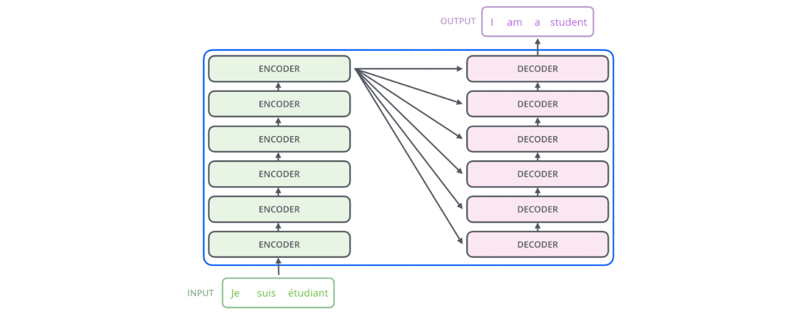

上述流程的详细结构如图2所示，整体分为如下三个部分，后面会详细讲述这三个部分以及个人理解。

-    **输入：** Encoder和Decoder都对应一个输入序列，Encoder对应的是翻译前序列（图1中的Je suis etudiant），Decoder对应的是翻译后序列（图1中的I am a student）
-    **EMB转换：** Encoder和Decoder的输入序列讲过EMB转换后，生成模型可读取格式
-    **Encoder：** \[Multi-Head Attention -> Add&Norm\]结构和\[Feed Forward -> Add&Norm\]结构
-    **Decoder：** 与Encoder大体相似，额外多出\[Masked Multi-Head Attention -> Add&Norm\]结构
-    **输出：** Decoder输出向量通过Feed Forward和Softmax，得到输出序列

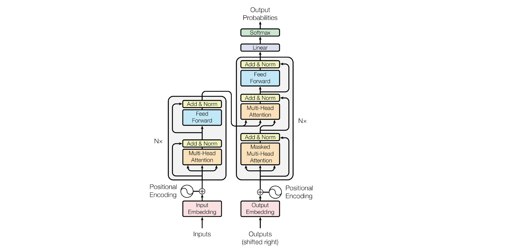

大家一定能够发现，图1中Decoder整体其实是没有输入的，但是图2中Decoder整体是有输入的，且输入的直接是OUTPUT，而输出依然是OUTPUT，这不是有些自相矛盾吗？究其原因，transformer是一个生成模型，用图3来说明缘由， **Decoder完成的任务是基于当前输入词来预测下一个词** ，因而Decoder的输入和输出其实并不一样，下文会详细讲述。


## 2. 模型输入

对于Encoder和Decoder，输入序列都要经过EMB转换才能输入到模型中，这里的EMB转换是指 **token向量化**  +  **位置编码，** 这里以Encoder为例进行说明（图4）。

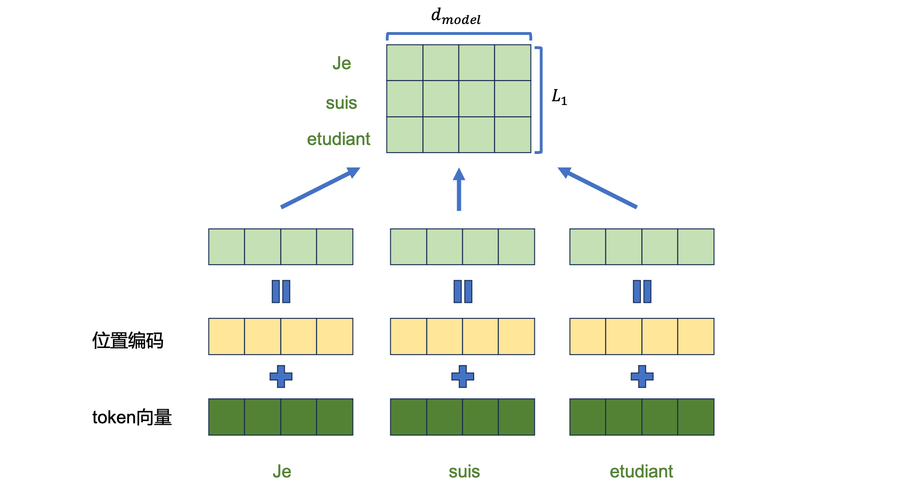

token向量化不在本文展开讲述，这里只讲位置编码，具体原理可见如下公式，其中  `!$PE$`  代表的是位置编码，它的形状和token向量一样，都是  `!$\left [ L_1, d_{model} \right ] $`  ，且  `!$pos$`  代表的是token在句子中的位置，  `!$2i$`  或  `!$2i+1$`  代表的是向量的某一维。

 `!$\begin{matrix} PE_{pos, 2i} = \sin \left ( pos / 10000 ^{2i/d_{model}} \right )  \\ PE_{pos, 2i+1} = \cos \left ( pos / 10000 ^{2i/d_{model}} \right )  \end{matrix}  \\$`  位置编码的具体代码实现如下所示，模块输入  `!$L_1$`  和  `!$d_{model}$`  ，输出形状为  `!$\left [ L_1, d_{model} \right ] $`  的向量。

```python
def get_angles(pos, i, d_model):
    # 这里的i等价与上面公式中的2i和2i+1
    angle_rates = 1 / np.power(10000, (2 * (i // 2)) / np.float32(d_model))
    return pos * angle_rates


def positional_encoding(l_1, d_model):
    angle_rads = get_angles(np.arange(l_1)[:, np.newaxis],
                            np.arange(d_model)[np.newaxis, :],
                            d_model)

    # 第2i项使用sin
    angle_rads[:, 0::2] = np.sin(angle_rads[:, 0::2])

    # 第2i+1项使用cos
    angle_rads[:, 1::2] = np.cos(angle_rads[:, 1::2])

    return tf.cast(angle_rads, dtype=tf.float32)

pos_encoding = positional_encoding(50, 512)
print(pos_encoding.shape)
>>> (50, 512)
```

## 3. 模型核心组件

### 3.1 掩码 mask

-    **padding\_mask：** 用于模型训练的句子长度都不相同，需要设置句子的最大长度max\_seq\_len。如果有的句子长度小于max\_seq\_len， 则会用0来填充，真正进行前向计算时这些填充的0不应该被考虑在内，因而需要通过padding\_mask把这些0标识出来，具体代码如下所示。padding\_mask在Encoder和Decoder中都会用到。

```python
def create_padding_mask(seq):
    # 获取为0的padding项
    seq = tf.cast(tf.math.equal(seq, 0), tf.float32)

    # 扩充维度以便用于attention矩阵
    return seq[:, np.newaxis, np.newaxis, :] # (batch_size,1,1,seq_len)

# padding_mask 测试
print(padding_mask([[1,2,0,0,0],[3,4,5,0,0]]))
>>> tf.Tensor(
[[[[0. 0. 1. 1. 1.]]]


 [[[0. 0. 0. 1. 1.]]]], shape=(2, 1, 1, 5), dtype=float32)
```

-    **look\_ahead\_mask：** 对未来要预测的token进行mask，换句话说，预测当前token时，只能看到当前词之前的token序列，整体流程如图5所示。

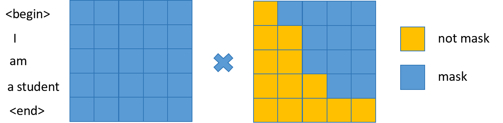

look\_ahead\_mask实现和测试代码如下所示，该掩码方式专门为Decoder的Masked Multi-Head Attention服务。

```python
def create_look_ahead_mask(size):
    # 1 - 对角线和取下三角的全部对角线（-1->全部）
    # 这样就可以构造出每个时刻未预测token的掩码
    mask = 1 - tf.linalg.band_part(tf.ones((size, size)), -1, 0)
    return mask  # (seq_len, seq_len)

# look_ahead_mask 测试
print(look_ahead_mask(3))

>>> tf.Tensor(
[[0. 1. 1.]
 [0. 0. 1.]
 [0. 0. 0.]], shape=(3, 3), dtype=float32)
```

-    **融合掩码：** Encoder需要padding\_mask，Decoder需要padding\_mask + look\_ahead\_mask，实现代码如下所示，

```python
def create_mask(inputs, targets):
    encode_padding_mask = create_padding_mask(inputs)
    # 这个掩码用于掩输入解码层第二层的编码层输出
    decode_padding_mask = create_padding_mask(inputs)

    # look_ahead 掩码， 掩掉未预测的词
    look_ahead_mask = create_look_ahead_mask(tf.shape(targets)[1])
    # 解码层第一层得到padding掩码
    decode_targets_padding_mask = create_padding_mask(targets)

    # 合并解码层第一层掩码， 只要两个mask中有一个为1，combine_mask就为1
    combine_mask = tf.maximum(decode_targets_padding_mask, look_ahead_mask)

    return encode_padding_mask, combine_mask, decode_padding_mask
```

### 3.2 Multi-Head Attention

Multi-Head Attention的基础为Self Attention，即图6左图所示，核心思想为计算Q(query)和K(key)之间的关系attn\_weight，并利用attn\_weight对V(value)进行修正，实现和测试代码如下所示，其中输入参数mask为3.1节中提到的不同掩码手段。

```python
def scaled_dot_product_attention(q, k, v, mask=None):
    # query key 相乘获取匹配关系
    matmul_qk = tf.matmul(q, k, transpose_b=True)

    # 使用dk进行缩放
    dk = tf.cast(tf.shape(k)[-1], tf.float32)
    attn_weight = matmul_qk / tf.math.sqrt(dk)

    # 掩码
    if mask is not None:
        attn_weight += (mask * -1e9)

    # 通过softmax获取attention权重
    attn_weight = tf.nn.softmax(attn_weight, axis=-1)

    # attention 乘上value
    output = tf.matmul(attn_weight, v)  # （.., seq_len_v, depth）

    return output, attn_weight

q = tf.constant([[0, 0, 10],
                 [0, 10, 0],
                 [10, 10, 0]], dtype=tf.float32)  # (3, 3)
k = tf.constant([[10, 0, 0],
                 [0, 10, 0],
                 [0, 0, 10],
                 [0, 0, 10]], dtype=tf.float32)  # (4, 3)
v = tf.constant([[1, 0],
                 [10, 0],
                 [100, 5],
                 [1000, 6]], dtype=tf.float32)  # (4, 3)

out, att = scaled_dot_product_attention(q, k, v, None)
print(att)
print(out)
>>> tf.Tensor(
[[0.  0.  0.5 0.5]
 [0.  1.  0.  0. ]
 [0.5 0.5 0.  0. ]], shape=(3, 4), dtype=float32)
tf.Tensor(
[[550.    5.5]
 [ 10.    0. ]
 [  5.5   0. ]], shape=(3, 2), dtype=float32)
```

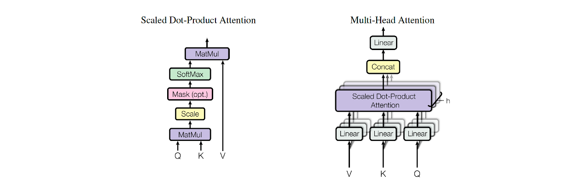

Multi-Head Attention（图6右图）的具体原理是将Q、K和V对应向量分成多份，每一份独立计算Self Attention，之后再将结果concat起来，这样就能挖掘向量在不同维度区间的关系，以Encoder的Multi-Head Attention为例，示意图如图7所示。

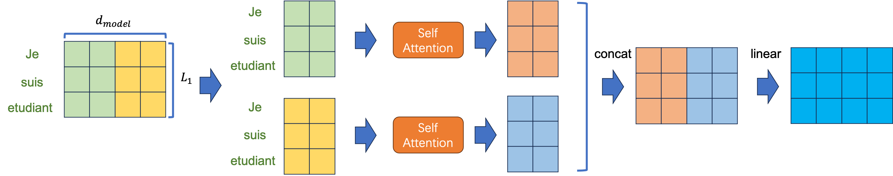

Multi-Head Attention实现和测试代码如下所示，可以发现Multi-Head Attention相当于对序列进行信息融合和提取。

```python
# 构造mutil head attention层
class MutilHeadAttention(tf.keras.layers.Layer):
    def __init__(self, d_model, num_heads):
        super(MutilHeadAttention, self).__init__()
        self.num_heads = num_heads
        self.d_model = d_model

        # d_model 必须可以正确分为各个头
        assert d_model % num_heads == 0
        # 分头后的维度
        self.depth = d_model // num_heads

        self.wq = tf.keras.layers.Dense(d_model)
        self.wk = tf.keras.layers.Dense(d_model)
        self.wv = tf.keras.layers.Dense(d_model)

        self.dense = tf.keras.layers.Dense(d_model)

    def split_heads(self, x, batch_size):
        # 分头, 将头个数的维度 放到 seq_len 前面
        x = tf.reshape(x, (batch_size, -1, self.num_heads, self.depth))
        return tf.transpose(x, perm=[0, 2, 1, 3])

    def call(self, v, k, q, mask):
        batch_size = tf.shape(q)[0]

        # 分头前的前向网络，获取q、k、v语义
        q = self.wq(q)  # (batch_size, seq_len, d_model)
        k = self.wk(k)
        v = self.wv(v)

        # 分头
        q = self.split_heads(q, batch_size) # (batch_size, num_heads, seq_len_q, depth)
        k = self.split_heads(k, batch_size)
        v = self.split_heads(v, batch_size)
        # scaled_attention.shape == (batch_size, num_heads, seq_len_v, depth)
        # attention_weights.shape == (batch_size, num_heads, seq_len_q, seq_len_k)

        # 通过缩放点积注意力层
        scaled_attention, attention_weights = scaled_dot_product_attention(
        q, k, v, mask)
        # 把多头维度后移
        scaled_attention = tf.transpose(scaled_attention, [0, 2, 1, 3]) # (batch_size, seq_len_v, num_heads, depth)

        # 合并多头
        concat_attention = tf.reshape(scaled_attention, 
                                      (batch_size, -1, self.d_model))

        # 全连接重塑
        output = self.dense(concat_attention)
        return output, attention_weights

mha = MutilHeadAttention(d_model=512, num_heads=8)
y = tf.random.uniform((1, 60, 512))
output, att = mha(y, k=y, q=y, mask=None)
print(output.shape, att.shape)
>>> (1, 60, 512) (1, 8, 60, 60)
```

### 3.3 LayerNorm

LayerNorm的核心思想是对参数进行归一化，从而加速网络的收敛，具体公式为  `!$y = \gamma \cdot \frac{x - \mu}{\sigma + \epsilon} + \beta$`  ，其中  `!$\mu$`  和  `!$\sigma$`  代表x在最后一维的均值和方差，  `!$\gamma$`  和  `!$\beta$`  都是超参数，  `!$\epsilon$`  代表防止除0的小数，实现代码如下所示。

```python
class LayerNormalization(tf.keras.layers.Layer):
    def __init__(self, epsilon=1e-6, **kwargs):
        self.eps = epsilon
        super(LayerNormalization, self).__init__(**kwargs)

    def build(self, input_shape):
        self.gamma = self.add_weight(name='gamma', shape=input_shape[-1:],
                                     initializer=tf.ones_initializer(), trainable=True)
        self.beta = self.add_weight(name='beta', shape=input_shape[-1:],
                                    initializer=tf.zeros_initializer(), trainable=True)
        super(LayerNormalization, self).build(input_shape)

    def call(self, x):
        mean = tf.keras.backend.mean(x, axis=-1, keepdims=True)
        std = tf.keras.backend.std(x, axis=-1, keepdims=True)
        output = self.gamma * (x - mean) / (std + self.eps) + self.beta
        return output

    def compute_output_shape(self, input_shape):
        return input_shape
```

## Encoder

下面开始正式介绍transformer的主体结构，这里会先讲Encoder架构，架构中包括N个EncoderLayer，每个EncoderLayer包括一个Multi-Head Attention模块和前向网络模块，每个模块串联一个Add&Norm结构（残差网络 + LayerNorm），每个模块的输入和输出比较直接，这里不赘述，EncoderLayer示意图如图8所示。


EncoderLayer的实现代码如下所示，这里额外添加了dropout来增加模型的鲁棒性。

```python
class EncoderLayer(tf.keras.layers.Layer):
    def __init__(self, d_model, n_heads, ddf, dropout_rate=0.1):
        super(EncoderLayer, self).__init__()

        self.mha = MutilHeadAttention(d_model, n_heads)
        self.ffn = point_wise_feed_forward_network(d_model, ddf)

        self.layernorm1 = LayerNormalization(epsilon=1e-6)
        self.layernorm2 = LayerNormalization(epsilon=1e-6)

        self.dropout1 = tf.keras.layers.Dropout(dropout_rate)
        self.dropout2 = tf.keras.layers.Dropout(dropout_rate)

    def call(self, inputs, training, mask):
        # 1. Multi-Head Attention
        att_output, _ = self.mha(inputs, inputs, inputs, mask)
        att_output = self.dropout1(att_output, training=training)
        out1 = self.layernorm1(inputs + att_output)  # (batch_size, input_seq_len, d_model)

        # 2. 前向网络
        ffn_output = self.ffn(out1)
        ffn_output = self.dropout2(ffn_output, training=training)
        out2 = self.layernorm2(out1 + ffn_output)  # (batch_size, input_seq_len, d_model)
        return out2
```

Encoder的实现代码如下所示，整体流程为输入端word\_emb + pos\_embedding，经过N层EncoderLayer，输出结果。

```python
class Encoder(tf.keras.layers.Layer):
    def __init__(self, n_layers, d_model, n_heads, ddf,
                 input_vocab_size, max_seq_len, drop_rate=0.1):
        super(Encoder, self).__init__()

        self.n_layers = n_layers
        self.d_model = d_model

        self.embedding = tf.keras.layers.Embedding(input_vocab_size, d_model)
        self.pos_embedding = positional_encoding(max_seq_len, d_model)

        self.encode_layer = [EncoderLayer(d_model, n_heads, ddf, drop_rate)
                             for _ in range(n_layers)]

        self.dropout = tf.keras.layers.Dropout(drop_rate)

    def call(self, inputs, training, mask):
        seq_len = inputs.shape[1]
        word_emb = self.embedding(inputs)
        word_emb *= tf.math.sqrt(tf.cast(self.d_model, tf.float32))
        emb = word_emb + self.pos_embedding[:, :seq_len, :]
        x = self.dropout(emb, training=training)
        for i in range(self.n_layers):
            x = self.encode_layer[i](x, training, mask)

        return x
```

## Decoder

Decoder是由M个DecoderLayer组成，DecoderLayer包括 1) 掩码Multi-Head Attention模块 2) Multi-Head Attention模块和 3) 前向网络模块组成。

-    **掩码Multi-Head Attention：** 输入为上一个DecoderLayer的输出，具体操作是padding\_mask（忽略padding\_mask对结果的影响） + look\_ahead\_mask（屏蔽未来token对预测当前token产生的影响）+ Multi-Head Attention
-    **Multi-Head Attention：** 输入为Encoder的输出 + 掩码Multi-Head Attention模块的输出，具体来讲，掩码Multi-Head Attention模块的输出作为Query，Encoder的输出作为Key和Value，进行Multi-Head Attention
-    **前向网络：** 不赘述

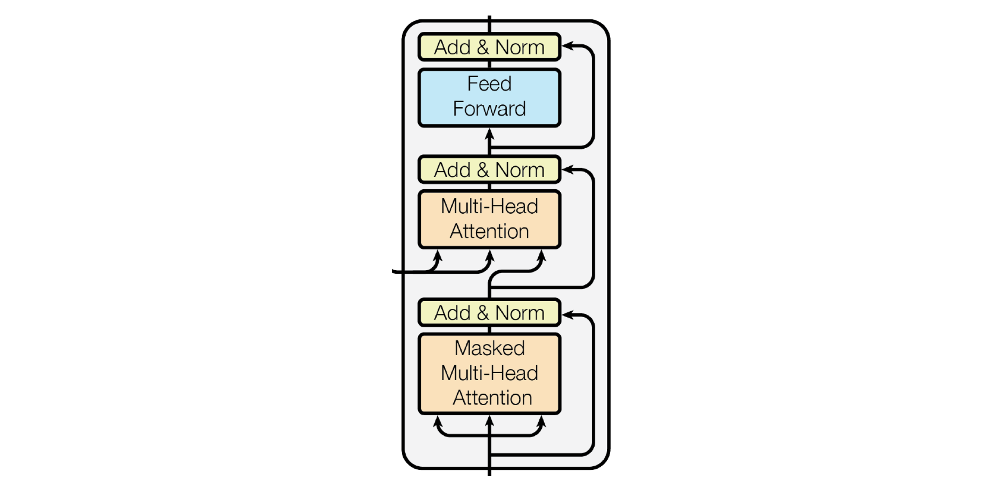

DecoderLayer的实现代码如下所示，

```python
class DecoderLayer(tf.keras.layers.Layer):
    def __init__(self, d_model, num_heads, dff, drop_rate=0.1):
        super(DecoderLayer, self).__init__()

        self.mha1 = MutilHeadAttention(d_model, num_heads)
        self.mha2 = MutilHeadAttention(d_model, num_heads)

        self.ffn = point_wise_feed_forward_network(d_model, dff)

        self.layernorm1 = LayerNormalization(epsilon=1e-6)
        self.layernorm2 = LayerNormalization(epsilon=1e-6)
        self.layernorm3 = LayerNormalization(epsilon=1e-6)

        self.dropout1 = tf.keras.layers.Dropout(drop_rate)
        self.dropout2 = tf.keras.layers.Dropout(drop_rate)
        self.dropout3 = tf.keras.layers.Dropout(drop_rate)

    def call(self, inputs, encode_out, training, look_ahead_mask, padding_mask):
        # 1. 掩码Multi-Head Attention模块
        att1, att_weight1 = self.mha1(inputs, inputs, inputs, look_ahead_mask)
        att1 = self.dropout1(att1, training=training)
        out1 = self.layernorm1(inputs + att1)

        # 2. Multi-Head Attention
        att2, att_weight2 = self.mha2(encode_out, encode_out, out1, padding_mask)
        att2 = self.dropout2(att2, training=training)
        out2 = self.layernorm2(out1 + att2)

        # 3. 前向网络
        ffn_out = self.ffn(out2)
        ffn_out = self.dropout3(ffn_out, training=training)
        out3 = self.layernorm3(out2 + ffn_out)

        return out3, att_weight1, att_weight2
```

Decoder的实现代码如下所示，整体流程为输出端word\_emb + pos\_embedding，经过M层DecoderLayer，输出结果。

```python
class Decoder(tf.keras.layers.Layer):
    def __init__(self, n_layers, d_model, n_heads, ddf,
                 target_vocab_size, max_seq_len, drop_rate=0.1):
        super(Decoder, self).__init__()

        self.d_model = d_model
        self.n_layers = n_layers

        self.embedding = tf.keras.layers.Embedding(target_vocab_size, d_model)
        self.pos_embedding = positional_encoding(max_seq_len, d_model)

        self.decoder_layers = [DecoderLayer(d_model, n_heads, ddf, drop_rate)
                               for _ in range(n_layers)]

        self.dropout = tf.keras.layers.Dropout(drop_rate)

    def call(self, inputs, encoder_out, training, look_ahead_mark, padding_mark):
        seq_len = tf.shape(inputs)[1]
        attention_weights = {}
        word_emb = self.embedding(inputs)
        word_emb *= tf.math.sqrt(tf.cast(self.d_model, tf.float32))
        word_emb += self.pos_embedding[:, :seq_len, :]

        h = self.dropout(word_emb, training=training)

        # 叠加解码层
        for i in range(self.n_layers):
            h, att_w1, att_w2 = self.decoder_layers[i](h, encoder_out,
                                                       training, look_ahead_mark,
                                                       padding_mark)
            attention_weights['decoder_layer{}_att_w1'.format(i + 1)] = att_w1
            attention_weights['decoder_layer{}_att_w2'.format(i + 1)] = att_w2

        return h, attention_weights
```

Decoder在训练时能够并行化的主要原因在于每一轮预测时，不使用上一轮预测的输出，而强制使用正确的单词。如果Decoder的groundtruth是“<start> I love china”，且Decoder输入“<start> I” 和 编码器的输出结果，Decoder没有正确预测出“Iove”，而是得到了“want”。下一次解码器模块输入的仍然是“<start> I love”。通过这样的方法可以有效的避免因中间预测错误而对后续序列的预测，从而加快训练速度。

但由于serving时Decoder不知道groundtruth，所以只能够依靠上一轮的输出作为输入，进行本轮的预测，因而在serving时Decoder无法实现并行化，所以才有了诸如KV cache之类的serving加速手段，用空间来换时间，这里援引大神的文章。

[大模型推理加速：KV Cache 和 GQA](https://zhuanlan.zhihu.com/p/708120479?utm_psn=1887208434472056037)[KV Cache - 从矩阵运算的角度理解](https://zhuanlan.zhihu.com/p/16080518294)

## transformer

这里总结下Encoder和Decoder的具体作用：

-   Encoder：经过Multi-Head Attention，进行输入端信息的双向提取，为输出端做准备。
-   Decoder：经过掩码Multi-Head Attention，进行输出端信息的单向提取，为预测任务做准备；经过Multi-Head Attention，对掩码Multi-Head Attention输出信息进行Encoder修正。

transformer的整体结构除了Encoder和Decoder之外，还包括最终的output操作，即将输出向量映射为最终的输出token，transformer整体的实现代码如下所示，其中self.final\_layer代表的是最终的output操作。

```python
class Transformer(tf.keras.Model):
    def __init__(self, n_layers, d_model, n_heads, diff,
                 input_vocab_size, target_vocab_size,
                 max_seq_len, drop_rate=0.1):
        super(Transformer, self).__init__()

        self.encoder = Encoder(n_layers, d_model, n_heads, diff,
                               input_vocab_size, max_seq_len, drop_rate)

        self.decoder = Decoder(n_layers, d_model, n_heads, diff,
                               target_vocab_size, max_seq_len, drop_rate)

        self.final_layer = tf.keras.layers.Dense(target_vocab_size)

    def call(self, inputs, targets, training, encode_padding_mask, look_ahead_mask, decode_padding_mask):
        encode_out = self.encoder(inputs, training, encode_padding_mask)
        decode_out, att_weights = self.decoder(targets, encode_out, training,
                                               look_ahead_mask, decode_padding_mask)
        final_out = self.final_layer(decode_out)

        return final_out, att_weights
```

这里展示训练的整体流程：当前任务是将Je suis etudiant翻译为I am a student，input序列为\[<begin>, Je, suis, etudiant, <end>\]，output输入序列为\[<begin>, I, am, a student\]，output输出序列为\[I, am, a student, <end>\]，这里忽略padding\_mask，只使用look\_ahead\_mask，且Encoder和Decoder的层数都只有1层，且input序列和output序列的embedding\_size都为4。

-   Encoder

利用Multi-Head Attention，将input序列进行双向信息学习，Encoder输出\[1, 5, 4\]（第一维是batch\_size）。

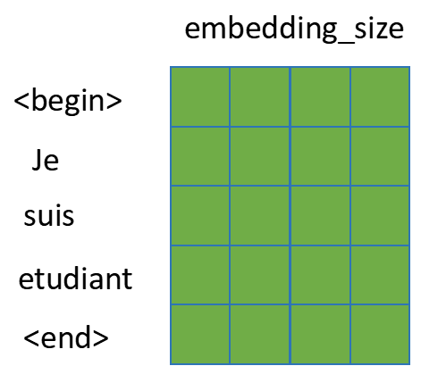

-   Decoder

先利用掩码Multi-Head Attention，对input序列进行单向信息学习，由于有look\_ahead\_mask的存在，不会造成未来信息泄露的问题。

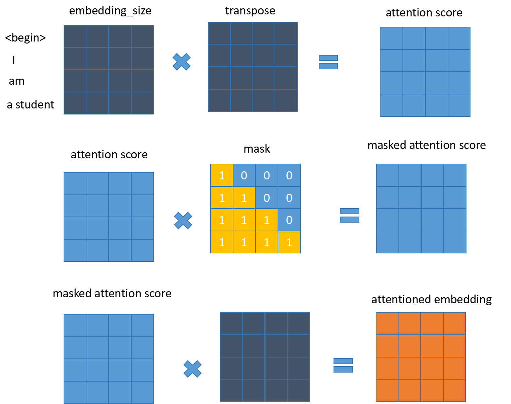

再通过Encoder的输出，对Decoder的第一次输出结果进行修正，具体流程是以Decoder输出为query，Encoder输出为key和value，进行Multi-Head Attention计算，得到Decoder输入序列的高阶表达形式，从而为后续预测next-token做准备。

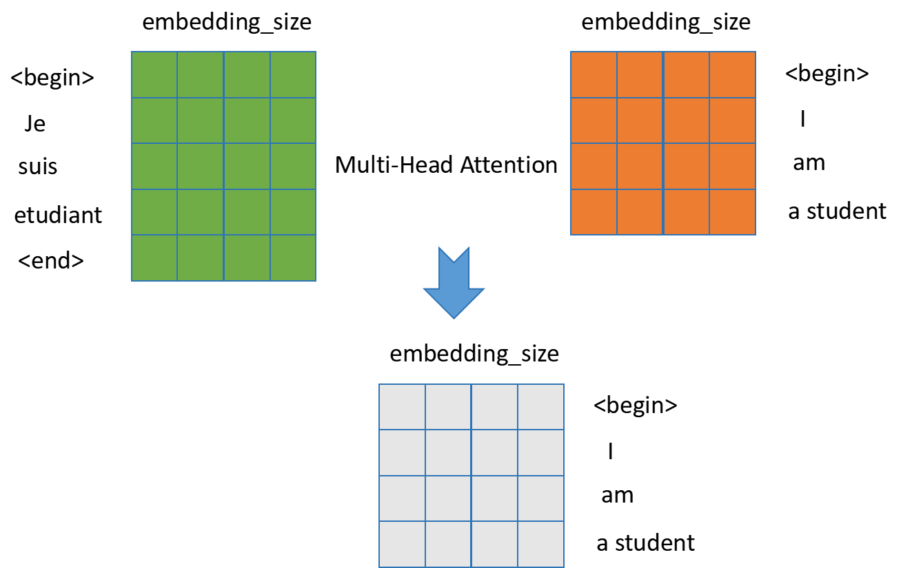

-   预测next-token：经过一层NN变换，每个token输出一个target\_vocab\_size长度的向量，代表next-token预测概率，为后续与真实next-token进行损失函数学习做准备。

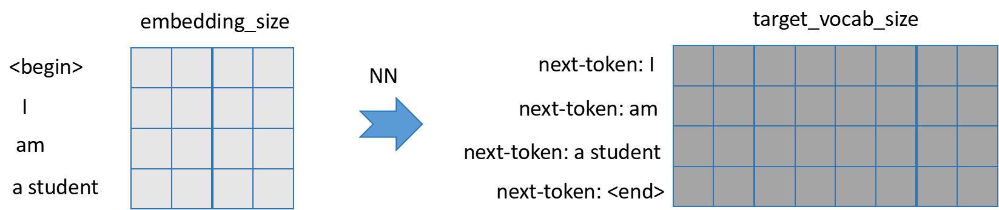

## 数据准备

1) 数据集下载和转换

```python
import tensorflow_datasets as tfds
import tensorflow as tf
examples, metadata = tfds.load('ted_hrlr_translate/pt_to_en', with_info=True,
                              as_supervised=True)
train_examples, val_examples = examples['train'], examples['validation']
tokenizer_en = tfds.deprecated.text.SubwordTextEncoder.build_from_corpus((en.numpy() for pt, en in train_examples), target_vocab_size=2**13)
tokenizer_pt = tfds.deprecated.text.SubwordTextEncoder.build_from_corpus((pt.numpy() for pt, en in train_examples), target_vocab_size=2**13)
```

2) token转换测试

```python
sample_str = 'hello world, hello transformer'
tokenized_str = tokenizer_en.encode(sample_str)
print(tokenized_str)
original_str = tokenizer_en.decode(tokenized_str)
print(original_str)
[3222, 439, 150, 7345, 3222, 439, 6514, 7945]
hello world, hello transformer
```

3) 数据预处理

```python
# 把输入和输出句子中每个token转换为idx
# 并在每个句子的开头添加start(vocab_size)，结尾添加end(vocab_size + 1)
def encode(lang1, lang2):
    lang1 = [tokenizer_pt.vocab_size] + tokenizer_pt.encode(lang1.numpy()) + [tokenizer_pt.vocab_size+1]
    lang2 = [tokenizer_en.vocab_size] + tokenizer_en.encode(
        lang2.numpy()) + [tokenizer_en.vocab_size+1]
    return lang1, lang2

# 过滤输入和输出中过长的句子
MAX_LENGTH=40
def filter_long_sent(x, y, max_length=MAX_LENGTH):
    return tf.logical_and(tf.size(x) <= max_length,
                         tf.size(y) <= max_length)

# 加速计算
def tf_encode(pt, en):
    return tf.py_function(encode, [pt, en], [tf.int64, tf.int64])
```

4) 训练数据预处理

```python
BUFFER_SIZE = 20000
BATCH_SIZE = 64

# 使用.map()运行相关图操作
train_dataset = train_examples.map(tf_encode)
# 过滤过长的数据
train_dataset = train_dataset.filter(filter_long_sent)
# 使用缓存数据加速读入
train_dataset = train_dataset.cache()
# 打乱并获取批数据
train_dataset = train_dataset.padded_batch(
BATCH_SIZE, padded_shapes=([40], [40]))  # 填充为最大长度 40
# 设置预取数据
train_dataset = train_dataset.prefetch(tf.data.experimental.AUTOTUNE)

# 验证集数据
val_dataset = val_examples.map(tf_encode)
val_dataset = val_dataset.filter(filter_long_sent).padded_batch(
BATCH_SIZE, padded_shapes=([40], [40]))
de_batch, en_batch = next(iter(train_dataset))
de_batch, en_batch
(<tf.Tensor: shape=(64, 40), dtype=int64, numpy=
 array([[8214,  116,   84, ...,    0,    0,    0],
        [8214,  155,   39, ...,    0,    0,    0],
        [8214, 2842,    1, ...,    0,    0,    0],
        ...,
        [8214,  639,  590, ...,    0,    0,    0],
        [8214,  204, 3441, ...,    0,    0,    0],
        [8214,   27,   13, ...,    0,    0,    0]])>,
 <tf.Tensor: shape=(64, 40), dtype=int64, numpy=
 array([[8087,   83,  145, ...,    0,    0,    0],
        [8087,  169,   56, ...,    0,    0,    0],
        [8087, 4088,    1, ...,    0,    0,    0],
        ...,
        [8087,  174,   79, ...,    0,    0,    0],
        [8087,   11,   16, ...,    0,    0,    0],
        [8087,    4,   12, ...,    0,    0,    0]])>)
```

## 模型训练和测试

1) 超参设置

```python
num_layers = 4
d_model = 128
dff = 512
num_heads = 8

input_vocab_size = tokenizer_pt.vocab_size + 2
target_vocab_size = tokenizer_en.vocab_size + 2
max_seq_len = 40
dropout_rate = 0.1 
```

2) 损失函数+优化器

```python
optimizer = tf.keras.optimizers.Adam(0.001, beta_1=0.9, 
                                    beta_2=0.98, epsilon=1e-9)
# one-hot + softmax + cross_entropy
loss_object = tf.keras.losses.SparseCategoricalCrossentropy(from_logits=True,
                                                           reduction='none')

def loss_fun(y_true, y_pred):
    mask = tf.math.logical_not(tf.math.equal(y_true, 0))  # 为0掩码标1
    loss_ = loss_object(y_true, y_pred)

    mask = tf.cast(mask, dtype=loss_.dtype)
    loss_ *= mask
    return tf.reduce_mean(loss_)
train_loss = tf.keras.metrics.Mean(name='train_loss')
train_accuracy = tf.keras.metrics.SparseCategoricalAccuracy(name='train_accuracy')
```

3) 模型搭建

```python
transformer = Transformer(num_layers, d_model, num_heads, dff,
                          input_vocab_size, target_vocab_size,
                          max_seq_len, dropout_rate)
checkpoint_path = './checkpoint/train'
ckpt = tf.train.Checkpoint(transformer=transformer,
                          optimizer=optimizer)
# ckpt管理器
ckpt_manager = tf.train.CheckpointManager(ckpt, checkpoint_path, max_to_keep=3)

if ckpt_manager.latest_checkpoint:
    ckpt.restore(ckpt_manager.latest_checkpoint)
    print('last checkpoit restore')
```

4) 训练模型

```python
@tf.function
def train_step(inputs, targets):
    '''
    inputs: encoder的输入
    targets: decoder的输入
    '''
    tar_inp = targets[:,:-1] # 排除句子的最后一个token
    tar_real = targets[:,1:] # 排除句子的第一个token

    # 构造掩码
    encode_padding_mask, combined_mask, decode_padding_mask = create_mask(inputs, tar_inp)

    with tf.GradientTape() as tape:
        predictions, _ = transformer(inputs, tar_inp,
                                    True,
                                    encode_padding_mask,
                                    combined_mask,
                                    decode_padding_mask)
        loss = loss_fun(tar_real, predictions)

    # 求梯度
    gradients = tape.gradient(loss, transformer.trainable_variables)
    # 反向传播
    optimizer.apply_gradients(zip(gradients, transformer.trainable_variables))

    # 记录loss和准确率
    train_loss(loss)
    train_accuracy(tar_real, predictions)

EPOCHS = 1
step_list = []
loss_list = []
step = 0

for epoch in range(EPOCHS):
    start = time.time()

    # 重置记录项
    train_loss.reset_states()
    train_accuracy.reset_states()

    # inputs 葡萄牙语， targets英语

    for batch, (inputs, targets) in enumerate(train_dataset):
        # 训练
        train_step(inputs, targets)

        if batch % 500 == 0:
            loss = train_loss.result()
            print('epoch {}, batch {}, loss:{:.4f}, acc:{:.4f}'.format(
            epoch+1, batch, loss, train_accuracy.result()
            ))
            step_list.append(step)
            loss_list.append(loss)
        step += 1

    if (epoch + 1) % 2 == 0:
        ckpt_save_path = ckpt_manager.save()
        print('epoch {}, save model at {}'.format(
        epoch+1, ckpt_save_path
        ))
```

4) 模型测试

当训练好模型后进行测试，实现代码如下所示，

```python
def evaluate(inp_sentence):
    start_token = [tokenizer_pt.vocab_size]
    end_token = [tokenizer_pt.vocab_size + 1]
    
    # 输入语句是葡萄牙语，增加开始和结束标记
    inp_sentence = start_token + tokenizer_pt.encode(inp_sentence) + end_token
    encoder_input = tf.expand_dims(inp_sentence, 0)

    # 因为目标是英语，输入 transformer 的第一个词应该是英语的start
    decoder_input = [tokenizer_en.vocab_size]
    output = tf.expand_dims(decoder_input, 0)

    for i in range(MAX_LENGTH):
        enc_padding_mask, combined_mask, dec_padding_mask = create_mask(encoder_input, output)
        predictions, attention_weights = transformer(encoder_input, 
                                                 output,
                                                 False,
                                                 enc_padding_mask,
                                                 combined_mask,
                                                 dec_padding_mask)

        # 从 seq_len 维度选择最后一个词
        predictions = predictions[: ,-1:, :]  # (batch_size, 1, vocab_size)
        predicted_id = tf.cast(tf.argmax(predictions, axis=-1), tf.int32)

        # 如果 predicted_id 等于结束标记，就返回结果
        if predicted_id == tokenizer_en.vocab_size + 1:
            return tf.squeeze(output, axis=0), attention_weights

        # 连接 predicted_id 与输出，作为解码器的输入传递到解码器。
        output = tf.concat([output, predicted_id], axis=-1)

    return tf.squeeze(output, axis=0), attention_weights
    
def translate(sentence, plot=''):
    result, attention_weights = evaluate(sentence)

    predicted_sentence = tokenizer_en.decode([i for i in result 
                                              if i < tokenizer_en.vocab_size])  

    print('输入: {}'.format(sentence))
    print('预测输出: {}'.format(predicted_sentence))
```

## Q&A

### encoder和decoder mask总结

-   encoder只有一种mask，即对inputs进行padding\_mask，用来通过补0来实现不用样本seq\_len的对齐。
-   decoder有三种mask：

-   对targets的padding\_mask，实现seq\_len对齐的效果，作用在Masked Multi-Head Attention模块。
-   对targets的look\_ahead\_mask，防止decoder预测时的信息泄露，作用在Masked Multi-Head Attention模块。
-   对encoder\_out的padding\_mask，剔除无效encoder\_out对结果的影响，作用在上层Multi-Head Attention模块。

### transformer处理变长数据

transformer模型输入变长的序列也是能处理的，因为transformer的模型参数只针对序列中的单个元素生效，不要求输入的序列长度一定是某个定长序列。transformer的模型参数如下：

-   attention计算时q、k和v对应的w权重矩阵
-   feedforward参数矩阵

但一般情况下需要保证一个batch下序列长度保持一致，这样有助于加速计算。

### sqrt(d\_model)的解释

[transformer模型中sqrt(d\_model)的解析-CSDN博客](https://blog.csdn.net/weixin_37688445/article/details/154616442?sharetype=blogdetail&sharerId=154616442&sharerefer=PC&sharesource=weixin_37688445&spm=1011.2480.3001.8118)

transformer框架中在两个地方用到了sqrt(d\_model):

-   encoder和decoder在输入到attention模块之前，对输入进行了乘以sqrt(d\_model)的操作
-   attention模型在计算完attention\_score之后到softmax之前进行了除以sqrt(d\_model)的操作

 **乘以sqrt(d\_model)：** 保证token\_embedding和position\_embedding的计算尺度较为平衡。一般情况下token\_embedding是用xavier初始化，长度为d\_model的向量（向量的每个元素服从(0, 1)高斯分布）的方差为1/d\_model，乘以sqrt(d\_model)后方差变为1，和position\_embedding尺度差不多，因而信息不会被position\_embedding淹没。

 **除以sqrt(d\_model)** ：保证softmax训练的稳定性。q和k点积的方差很大，极端情况下会导致softmax的输入很大，从而导致softmax之后变为one-hot向量，和v乘完之后再进行梯度回传时，导致梯度消失。除以sqrt(d\_model)能将方差来回到，从而保证训练的稳定性。

源代码：[https://gitee.com/gmlyytt/transformer](https://gitee.com/gmlyytt/transformer)

## 参考

1. [NLP中的Transformer架构在训练和测试时是如何做到decoder的并行化的？](https://www.zhihu.com/question/307197229/answer/1859981235?utm_psn=1864097297203355648)

  

原文地址：[GPT （一）transformer原理和代码详解](https://zhuanlan.zhihu.com/p/632880248) 


